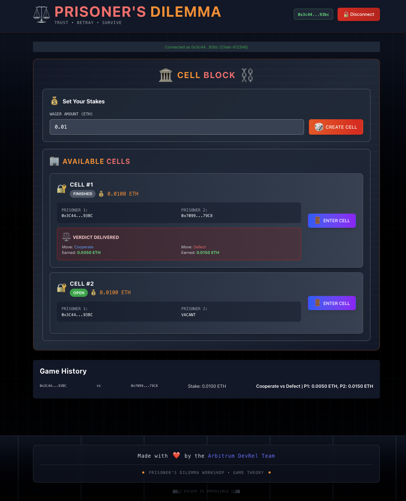

# 🎯 Arbitrum Prisoner's Dilemma Iterated Game Workshop

> [!NOTE]
> Learn game theory and smart contract development on Arbitrum using Stylus (Rust). Build and deploy a multiplayer, iterated Prisoner's Dilemma game with strategic decision-making, token staking, and multiple rounds per match. All in a preconfigured Codespace!

<div align="center">
  
</div>

| Learning Outcomes |
|---|
| Understand game theory and the Prisoner's Dilemma |
| Deploy and interact with Stylus (Rust) smart contracts on Arbitrum |
| Implement strategic multiplayer games with token staking and multiple rounds |
| Use cargo stylus, foundry (cast), and viem + wagmi |
| Connect game contracts to a React + Vite + TypeScript frontend with real-time state updates |
| Practice contract interaction patterns, state management, and iterative game logic |

## 🎮 Game Rules: Iterated Prisoner's Dilemma


The Iterated Prisoner's Dilemma is a classic game theory scenario where two players repeatedly choose between **cooperation** and **defection** over multiple rounds, without knowing the other's choice in each round. This version introduces strategic depth, as players can adapt their choices based on previous outcomes.

### How It Works

1. **Join a Cell**: Players stake ETH to create or join a cell (game instance). Each cell is assigned a random number of rounds (between 2 and 5) for iterated play.
2. **Play Rounds**: In each round, both players secretly choose to **Cooperate** (0) or **Defect** (1). Choices are revealed simultaneously.
3. **Continue or Exit**: After each round, both players must independently decide whether to continue to the next round or exit. The game continues only if both agree and the maximum rounds for the cell have not been reached.
4. **Payouts & Results**: After the final round or if a player exits, payouts are distributed based on the cumulative results of all rounds played in the cell.


### Payoff Matrix (Per Round)

| Your Move | Opponent's Move | Your Payout | Opponent's Payout |
|-----------|-----------------|-------------|-------------------|
| 🤝 Cooperate | 🤝 Cooperate | **1.0x stake** | **1.0x stake** |
| 🤝 Cooperate | 💀 Defect | **0.5x stake** | **1.5x stake** |
| 💀 Defect | 🤝 Cooperate | **1.5x stake** | **0.5x stake** |
| 💀 Defect | 💀 Defect | **0.5x stake** | **0.5x stake** |


### Iterative Strategic Considerations

- **Memory & Adaptation**: Players can adjust their strategy based on previous rounds (e.g., tit-for-tat, always defect, always cooperate).
- **Continuation Decisions**: After each round, both players must opt-in to continue. If either declines, the cell ends and payouts are distributed.
- **Randomized Rounds**: Each cell has a random number of rounds (2-5), so players cannot always predict when the game will end, increasing strategic uncertainty.
- **Mutual Cooperation**: Both players get a fair return (1.0x per round)
- **Mutual Defection**: Both players lose (0.5x per round) - the "tragedy" of the dilemma
- **Mixed Strategies**: The defector wins big (1.5x per round), but the cooperator loses (0.5x per round)

**The Dilemma**: While mutual cooperation yields the best collective outcome, individual incentives push toward defection—especially in the final round!

## Quick Start (GitHub Codespaces)

Run the workshop in a preconfigured Codespace — no setup required!

[](https://codespaces.new/hummusonrails/arbitrum-prisoners-dilemma-workshop)

**Steps:**
1. Click the button above.
2. Wait for initialization.
3. Open a terminal (Terminal → New Terminal).
4. Follow the workshop steps below.

## What You'll Do

- ✅ Set up a local Arbitrum Nitro Devnode
- ✅ Deploy and interact with a Stylus (Rust) Prisoner's Dilemma contract
- ✅ Use cargo stylus and foundry (cast) for contract deployment
- ✅ Connect the game contract to a React + Vite + TypeScript frontend
- ✅ Implement strategic gameplay with local testnet ETH staking
- ✅ Practice game theory concepts in a blockchain environment

## Local Requirements (Skip if using Codespaces)

For running locally:
- [pnpm](https://pnpm.io/installation)
- [nvm](https://github.com/nvm-sh/nvm#installing-and-updating)
- [rust](https://rustup.rs/)
- [foundry](https://book.getfoundry.sh/getting-started/installation)
- [Docker](https://www.docker.com/products/docker-desktop/)
- [Nitro-devnode](https://github.com/OffchainLabs/nitro-devnode?tab=readme-ov-file#usage)

## Project Structure Overview

```bash
contracts/
└── prisoners-dilemma/         # Stylus (Rust) Prisoner's Dilemma contract
  ├── src/
  │   ├── lib.rs             # Main contract implementation
  │   └── main.rs            # (if present, entry point for bin)
  ├── Cargo.toml             # Rust dependencies
  ├── rust-toolchain.toml    # Rust toolchain config
  ├── package.json           # Build and deploy scripts
  └── target/                # Build output
frontend/                      # React + Vite + TS frontend
├── public/
└── src/
  ├── abi/                   # Contract ABI
  │   └── PrisonersDilemmaContract.json
  ├── components/            # Game UI components (CellView, GameLobby, MoveButtons, etc.)
  ├── contexts/              # Web3 context and state
  ├── hooks/                 # Custom hooks for cell/game state
  ├── lib/                   # Contract interaction logic (contract.ts)
  ├── types/                 # TypeScript types
  ├── utils/                 # CellManager and helpers for round/cell logic
  ├── App.tsx
nitro-devnode/                 # Local Arbitrum node
scripts/
├── funds.sh                   # Fund test accounts
└── package.json               # Script utilities
```

## Workshop Exercises

### 1. Install Dependencies

```bash
pnpm install -r
```

### 2. Start Local Arbitrum Node

> [!NOTE]
> Codespaces users: This is mostly handled for you, but you still need to manually start the devnode.

```bash
cd nitro-devnode
./run-dev-node.sh
```

### 3. Build & Deploy Prisoner's Dilemma Contract

* The Stylus contract is implemented in `contracts/prisoners-dilemma/src/lib.rs`.

> [!WARNING]
> The contract code is incomplete! Your first task is to complete the workshop objectives in `lib.rs`.
> The `deploy:local` command below will **fail** until you complete the exercises.

* Once you have completed the exercises, build and deploy locally:

```bash
pnpm --filter prisoners-dilemma-contract deploy:local
```

* **Important**: Copy the deployed contract address from the output for later use.

### 4. Export Contract ABI (for Frontend Integration)

* Use cargo stylus to export the ABI for frontend integration:

```bash
cd contracts/prisoners-dilemma
cargo stylus export-abi --json > ../../frontend/src/abi/PrisonersDilemma.json
```

* Open the exported ABI file and ensure it contains only the ABI in JSON format.

### 5. Connect Frontend to Contract

* The frontend is in `frontend/`.
* Update the contract address in your `contract.ts` file:

```typescript
// frontend/src/lib/contract.ts
const CONTRACT_ADDRESS = '0x...' as `0x${string}`;
```

### 6. Smart Contract Workshop

Your main task is to complete the missing pieces of the smart contract. Open `contracts/prisoners-dilemma/src/lib.rs` and look for the `TODO` comments. These are your workshop objectives.

#### 🎯 Objective 1: Create a New Cell
- **Location**: `create_cell` function.
- **Task**: Initialize the `Cell` struct when a new game is created. This involves setting the initial players, stake, and round information.

#### 🎯 Objective 2: Implement the Payoff Logic
- **Location**: `resolve_round` function.
- **Task**: This is the heart of the game! Implement the payoff matrix that determines player payouts based on their moves.
- **Challenge**: Start with the classic Prisoner's Dilemma rules, then invent your own! See how changing the incentives alters player behavior. Will you create a world of total cooperation or endless conflict?

Once you've completed the objectives, the contract should compile successfully. You can then proceed with the deployment and testing steps.

### 7. Start the Frontend

```bash
pnpm --filter frontend dev
```

### 9. Test Accounts & Funding

**Deployer Account:**
* Address: `0x3f1Eae7D46d88F08fc2F8ed27FCb2AB183EB2d0E`
* Private Key: `0xb6b15c8cb491557369f3c7d2c287b053eb229daa9c22138887752191c9520659`

**Test Users:**

| Index  | Address | Private Key |
| ------------- | ------------- | ----------- |
| 0  | 0xf39Fd6e51aad88F6F4ce6aB8827279cffFb92266 | 0xac0974bec39a17e36ba4a6b4d238ff944bacb478cbed5efcae784d7bf4f2ff80 |
| 1  | 0x70997970C51812dc3A010C7d01b50e0d17dc79C8 | 0x59c6995e998f97a5a0044966f0945389dc9e86dae88c7a8412f4603b6b78690d |
| 2  | 0x3C44CdDdB6a900fa2b585dd299e03d12FA4293BC | 0x5de4111afa1a4b94908f83103eb1f1706367c2e68ca870fc3fb9a804cdab365a |
| 3  | 0x90F79bf6EB2c4f870365E785982E1f101E93b906 | 0x7c852118294e51e653712a81e05800f419141751be58f605c371e15141b007a6 |
| 4  | 0x15d34AAf54267DB7D7c367839AAf71A00a2C6A65 | 0x47e179ec197488593b187f80a00eb0da91f1b9d0b13f8733639f19c30a34926a |
| 5  | 0x9965507D1a55bcC2695C58ba16FB37d819B0A4dc | 0x8b3a350cf5c34c9194ca85829a2df0ec3153be0318b5e2d3348e872092edffba |
| 6  | 0x976EA74026E726554dB657fA54763abd0C3a0aa9 | 0x92db14e403b83dfe3df233f83dfa3a0d7096f21ca9b0d6d6b8d88b2b4ec1564e |
| 7  | 0x14dC79964da2C08b23698B3D3cc7Ca32193d9955 | 0x4bbbf85ce3377467afe5d46f804f221813b2bb87f24d81f60f1fcdbf7cbf4356 |
| 8  | 0x23618e81E3f5cdF7f54C3d65f7FBc0aBf5B21E8f | 0xdbda1821b80551c9d65939329250298aa3472ba22feea921c0cf5d620ea67b97 |
| 9  | 0xa0Ee7A142d267C1f36714E4a8F75612F20a79720 | 0x2a871d0798f97d79848a013d4936a73bf4cc922c825d33c1cf7073dff6d409c6 |

**Fund User Wallets:**

```bash
./scripts/funds.sh
```

### 10. Testing and Checking Contracts

To check if the contract compiles and is valid, run:

```bash
pnpm --filter prisoners-dilemma-contract check
```

To estimate gas for deployment, run:

```bash
pnpm --filter prisoners-dilemma-contract estimate-gas
```

To test the contract, run:

```bash
pnpm --filter prisoners-dilemma-contract test
```

## Network Settings

**Local Network:**
- Name: Localhost-Nitro
- RPC: http://localhost:8547
- Chain ID: 412346

**Codespaces RPC:**
- Use the forwarded port URL from the "Ports" tab (e.g., `https://your-codespace-8547.app.github.dev`)

## 🧠 Iterated Game Theory Insights

The Prisoner's Dilemma illustrates fundamental concepts in:

- **Economics**: Market competition and cooperation
- **Politics**: International relations and treaties
- **Biology**: Evolution of cooperation
- **Blockchain**: Protocol design and validator behavior

### Strategies to Explore

1. **Always Cooperate**: Optimistic but vulnerable
2. **Always Defect**: Pessimistic but safe
3. **Tit-for-Tat**: Start cooperative, then mirror opponent's previous move
4. **Random**: Unpredictable mixed strategy

### Real-World Applications

- **DeFi Protocols**: Validator staking and slashing
- **DAOs**: Governance participation vs free-riding
- **MEV**: Cooperation vs competition among searchers
- **Layer 2s**: Honest vs malicious operator behavior

## 🧑‍💻 Workshop Tips

- Use different accounts to simulate real multiplayer scenarios
- Try various stake amounts and see how the number of rounds affects decision-making
- Experiment with different strategies and track outcomes across multiple rounds
- Consider the psychological aspects: How does anonymity and round uncertainty affect choices?
- Think about mechanism design: How could the game be modified to encourage cooperation or longer play?

Happy strategizing! 🎯
