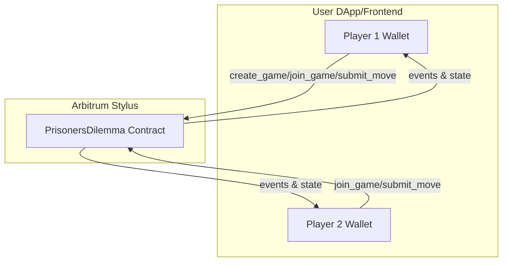
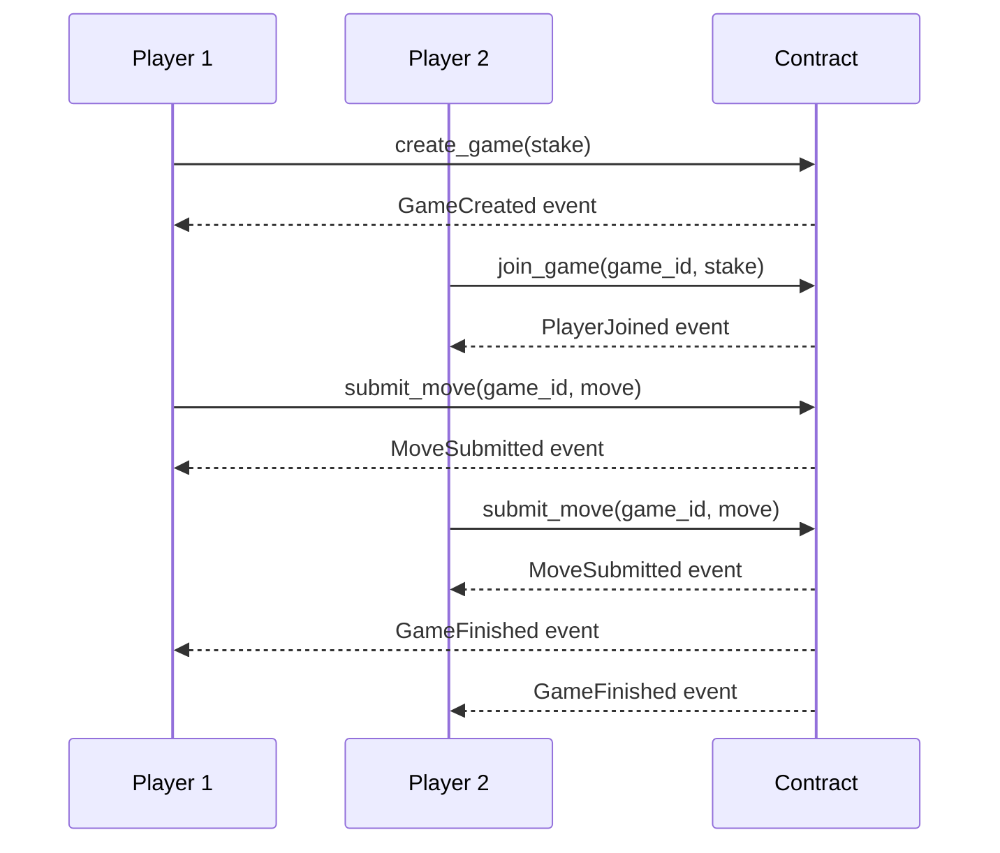

# Prisoner's Dilemma Multiplayer Game Contract

## Overview

This project implements a fully onchain, multiplayer Prisoner's Dilemma game as a smart contract in Rust written for Arbitrum Stylus. Players stake tokens, join games, and submit moves (cooperate or defect) with classic payoff logic. The contract is designed for seamless integration with a web frontend.

## Architecture

### High-Level Diagram



### Storage Layout

- `game_counter: uint256` – Unique game IDs
- `games: mapping(uint256 => bytes)` – Serialized game state
- `player_to_game: mapping(address => uint256)` – Player's active game
- `game_stakes: mapping(uint256 => uint256)` – Stakes per game
- `min_stake: uint256` – Minimum required stake
- `owner: address` – Contract owner

### Game State (Serialized)
- `player1: address`
- `player2: address`
- `stake_amount: uint256`
- `player1_move: Option<Move>`
- `player2_move: Option<Move>`
- `is_finished: bool`
- `block_created: uint256`

### Events
- `GameCreated(game_id, player1, stake_amount)`
- `PlayerJoined(game_id, player2)`
- `MoveSubmitted(game_id, player)`
- `GameFinished(game_id, player1, player2, player1_move, player2_move, player1_payout, player2_payout)`

## Game Flow



## Contract API

### External Methods

- `initialize(min_stake: U256)` – Set minimum stake and owner
- `create_game() -> U256` – Start a new game (payable)
- `join_game(game_id: U256)` – Join an existing game (payable)
- `submit_move(game_id: U256, move_choice: u8)` – Submit move (0 = cooperate, 1 = defect)
- `get_game(game_id: U256) -> (Address, Address, U256, bool, bool, bool)` – Query game state
- `get_player_game(player: Address) -> U256` – Query player's current game
- `get_min_stake() -> U256` – Query minimum stake
- `get_game_counter() -> U256` – Query number of games

## Integration with a Frontend

### Example Frontend Flow
1. **Connect wallet**
2. **Create game**: Call `create_game()` with a stake
3. **Join game**: Second player calls `join_game(game_id)` with matching stake
4. **Submit moves**: Both players call `submit_move(game_id, move_choice)`
5. **Listen for events**: Use contract events to update UI in real time
6. **Query state**: Use `get_game` and `get_player_game` to display status

### Example UI Components
- **Game lobby**: List open games, allow joining
- **Game board**: Show both players, moves (if revealed), and stake
- **Move submission**: Buttons for "Cooperate" and "Defect"
- **Results**: Show outcome and payouts after both moves
- **History**: List of finished games and stats

## Payoff Matrix

|               | Player 2: Cooperate | Player 2: Defect |
|---------------|--------------------|------------------|
| **Player 1: Cooperate** | (1x, 1x)           | (0.5x, 1.5x)      |
| **Player 1: Defect**    | (1.5x, 0.5x)       | (0.5x, 0.5x)      |

Where `x` is the stake amount per player.

## Testing

- The contract includes unit tests in Rust (see `src/lib.rs`)
- To run tests:
  ``` sh
  cargo test
  ```
- Tests cover: initialization, game creation, joining, moves, resolution, and edge cases

## Security & Limitations
- This contract is a template and has **not been audited**
- Use only on a local developer node or testnets unless audited

